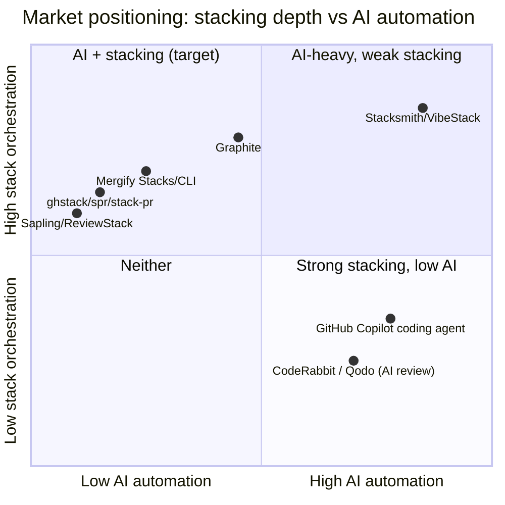
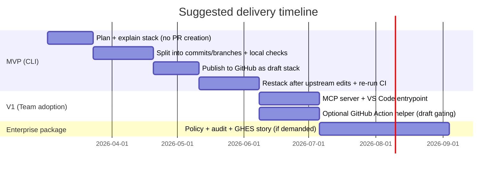

# Market analysis for a CLI + AI agent that splits large AI-generated diffs into CI-green stacked PRs

## Executive summary

Your product thesis is solid: AI-assisted coding is inflating PR size faster than review capacity, and review quality collapses when diffs get too big. entity["company","Salesforce","crm software company"] reports ~30% code-volume increase and PRs “regularly” exceeding 20 files and 1,000 lines after AI tooling adoption, with review latency increasing and reviewer engagement plateauing/declining on the largest PRs. citeturn21view0

There is already an active “stacked PRs” market (commercial platforms + OSS CLIs + Git clients), but almost all tooling assumes the author already knows how to slice work into a clean commit/branch stack. citeturn13view0turn12view1turn12view0turn12view2turn34view0turn34view1 The gap is automated decomposition + stack maintenance under review, with a hard constraint that every layer stays CI-green and updates cascade after upstream review feedback—especially relevant for strict-review enterprises and OSS maintainers battling “AI slop.” citeturn22view0

Recommendation: ship an MVP as a local-first CLI (TypeScript or Python) that (1) proposes a linear stack plan, (2) materialises it as commits/branches, (3) runs “representative” CI locally when possible, and (4) opens PRs in draft mode except the top PR. This aligns with enterprise security expectations and with existing GitHub PR workflows, while positioning you as a complement (not a replacement) to stacked-PR and AI-review tools. citeturn7search1turn23search0turn13view0

## Competitive landscape

The ecosystem breaks into four buckets:

Commercial stacked-PR workflow platforms (notably Graphite) that cover stacking and team review workflow, often bundled with AI review features. citeturn13view1turn13view0turn15view0  
Open-source and CLI-first stack submitters (ghstack, spr, stack-pr, Git Town) that convert local commits/branches into multiple GitHub PRs, but require the author to do the decomposition. citeturn12view0turn12view2turn12view1turn24view0  
Merge/rebase orchestration products adding “Stacks” as a feature (Mergify) and Git clients that operationalise stacking (Tower). citeturn34view0turn36view2turn34view1  
AI agents/reviewers (Copilot coding agent, CodeRabbit, Qodo PR-Agent, etc.) that can create or review PRs, but generally do not split one big diff into a maintained PR stack. citeturn19view0turn19view1turn29view0turn28view0turn30view0

### Competitor matrix

Legend for “Core features”: **S** stacking/dependent PRs, **R** auto-restack/rebase, **C** CI-aware gating/validation, **A** AI planning/splitting.

| Name | Category | Core features (S/R/C/A) | Languages supported | Pricing (public) | Enterprise readiness | Notable customers/users (public/claimed) |
|---|---|---:|---|---|---|---|
| Graphite | Commercial stacked PR platform (CLI + web) | S✅ R✅ C🟡 A🟡 | Language-agnostic (Git/GitHub) | $20/seat/mo (Starter), $40/seat/mo (Team), Enterprise custom. citeturn13view1 | SSO/SAML, audit log/SIEM, GHES support for Enterprise customers; no self-hosted Graphite offering. citeturn13view1turn15view0 | Shopify case study on Graphite site. citeturn5search1 |
| Mergify | Merge automation platform with “Stacks” + CLI | S✅ R✅ C🟡 A❌ | Language-agnostic (Git/GitHub) | $0 (OSS/small), $21/seat/mo, Enterprise custom. citeturn36view1 | On‑prem deployment is listed as an Enterprise option. citeturn36view1 | Not specified on pricing page (marketing section exists but not reliably parseable). citeturn36view1 |
| Mergify CLI | CLI tool for stacked PRs + CI results upload | S✅ R🟡 C✅ A❌ | Language-agnostic | OSS (pip package), pricing not specified for CLI itself. citeturn36view2 | Tied to GitHub tokens/permissions; enterprise posture depends on deployment. citeturn34view0turn36view2 | Not specified. citeturn36view2 |
| Tower Git Client | Git GUI adding stacked PR workflow | S✅ R✅ C❌ A❌ | Language-agnostic | Subscription model; 30‑day trial; price not shown in the captured pricing content. citeturn36view3turn34view1 | Desktop client; enterprise depends on procurement/IT controls; integrates with Graphite workflow. citeturn34view1 | Claims “over 100,000 developers” use Tower. citeturn35search4 |
| stack-pr (Modular) | OSS CLI for stacked PRs on GitHub | S✅ R🟡 C❌ A❌ | Language-agnostic | Free/OSS | Uses GitHub CLI auth; enterprise posture depends on repo policies. citeturn12view1 | Not specified. citeturn12view1 |
| ghstack | OSS CLI for stacked diffs on GitHub | S✅ R🟡 C❌ A❌ | Language-agnostic | Free/OSS | Requires write permission; uses GitHub token; cannot merge via normal GitHub UI (uses `ghstack land`). citeturn12view0 | Common in some large OSS communities (not explicitly claimed in captured docs). citeturn12view0 |
| spr (spacedentist) | OSS CLI for stacked PRs from commits | S✅ R🟡 C❌ A❌ | Language-agnostic | Free/OSS | Guides user through GitHub API authorisation; enterprise depends on policy. citeturn12view2 | Not specified. citeturn12view2 |
| Git Town | Git workflow CLI with first-class stacked branches | S✅ R✅ C❌ A❌ | Language-agnostic | Free/OSS (core); commercial support varies (not in captured docs) | Helps manage lineage + syncing; doesn’t inherently enforce CI-green stack. citeturn24view0 | Not specified. citeturn24view0 |
| Git Town Action | GitHub Action to visualise stacks in PRs | S🟡 R❌ C❌ A❌ | Language-agnostic | Free/OSS | Requires `pull-requests: write` if updating PR description; has fork limitations. citeturn24view1 | Not specified. citeturn24view1 |
| Sapling (Meta) | Stack-first SCM client (Git-compatible) | S✅ R✅ C❌ A❌ | Language-agnostic | Free/OSS | Used internally at Meta at very large scale; Git-compatible client is OSS. citeturn17view0 | Meta internal usage (tens of thousands of developers implied). citeturn17view0 |
| ReviewStack | Stack-oriented review UI for GitHub PRs | S🟡 R❌ C❌ A❌ | Language-agnostic | Free (demo UI) | Known GitHub Enterprise integration issues reported in Sapling tracker. citeturn4search9turn4search21 | Demonstration UI by Meta team. citeturn17view0turn4search9 |
| “Stacked Pull Requests” GitHub Marketplace App | GitHub App that splits PRs into sub‑PRs | S✅ R🟡 C🟡 A❌ | Lists: JS, Ruby, Python, Obj‑C, Java, Go, C#, Rust, TS, Swift. citeturn16view0 | Beta Free ($0); ~133 installs shown. citeturn16view0 | Low signals of enterprise maturity (beta/free, low installs; limited transparency). citeturn16view0 | Not specified. citeturn16view0 |
| Gerrit Code Review | Code review system with dependent “changes” | S✅ R✅ C🟡 A❌ | Language-agnostic | Free/OSS | Natively models dependent changes and topics for submission logic. citeturn36view0 | Widely used in large infra orgs (not asserted from captured sources). citeturn36view0 |
| Phabricator | Code review platform (“Differential”) | S✅ (diff stacks common) R🟡 C❌ A❌ | Language-agnostic | Legacy OSS/community-maintained; pricing unspecified | Self-hosted possible historically; current ecosystem fragmented. citeturn3search19 | Not specified. citeturn3search19 |
| GitLab MR dependencies | Platform feature for dependent MRs | S✅ R🟡 C🟡 A❌ | Language-agnostic | Depends on GitLab tiers (not resolved here) | Enterprise-ready platform feature; not GitHub-focused. citeturn3search20 | Not specified. citeturn3search20 |
| GitHub Copilot coding agent | AI agent that creates PRs | S❌ R🟡 C🟡 A✅ | Language-agnostic | Included in Copilot Pro/Pro+/Business/Enterprise. citeturn19view1 | Runs in GitHub Actions-powered environment; integrates deeply into GitHub workflow. citeturn19view0 | GitHub-native. citeturn19view1 |
| CodeRabbit | AI PR review product (GitHub App/IDE/CLI) | S❌ R❌ C🟡 A🟡 | “All languages” in practice (PR-level). | $24/mo billed annually or $30 monthly; Enterprise “Talk to us” + self-hosting option. citeturn29view1 | Explicit enterprise features include self-hosting, RBAC, SLA, marketplaces. citeturn29view1 | Customers page exists; specific customer claims not captured here. citeturn29view1 |
| Qodo (incl. PR-Agent) | AI PR review + governance platform | S❌ R❌ C🟡 A🟡 | “All major languages” (platform claim). citeturn30view0 | Teams $30–$38/user/mo (promo details); Enterprise includes SSO and on‑prem/air‑gapped options. citeturn30view0 | Strong enterprise posture (on‑prem/air‑gapped listed). citeturn30view0 | OSS PR-Agent exists; Qodo positions it as legacy/community vs product offer. citeturn28view0 |
| Sweep | AI coding assistant (IDE-first; agent + BYOK) | S❌ R❌ C❌ A✅ | Language-agnostic (IDE scope) | $10/$20/$60 per month individual plans; credits model + BYOK. citeturn31view0turn31view1 | Team plan references SSO + privacy controls. citeturn31view1 | Claims “trusted” with logos shown (Ramp, Atlassian, etc.). citeturn31view0 |
| Sourcegraph | Code intelligence + agentic tooling | S❌ R❌ C❌ A✅ | Language-agnostic | Pricing page lists enterprise pricing (details vary); Cody plans changed in 2025. citeturn18search2turn18search7 | Enterprise focus; codebase-scale posture. citeturn18search2 | Not specified. citeturn18search2 |

image_group{"layout":"carousel","aspect_ratio":"16:9","query":["Graphite stacked pull requests UI screenshot","reviewstack.dev stacked pull request UI screenshot","Mergify stacked pull requests screenshot","Tower Git client stacked pull requests screenshot"],"num_per_query":1}

### What this landscape implies

Stack tooling is crowded enough to validate demand. Graphite, Mergify, Git Town, and multiple OSS CLIs exist because manual stacking is genuinely painful and GitHub’s branch↔PR model is inherently 1:1. citeturn34view0turn13view0turn24view0turn12view1turn12view0turn12view2  
But decomposition is still a human skill. Almost every stack tool says “make one commit per PR” or “create multiple commits/branches” and then it helps you publish/sync them. citeturn12view1turn12view0turn12view2turn34view0turn13view0  
GitHub is moving up-stack aggressively into agents and agent orchestration (“Agent HQ”, PR-creating coding agent). That’s both a distribution opportunity (integrate) and a platform risk (they may ship “split into stack” natively). citeturn27view0turn19view0turn19view1

## Customer segments and buying dynamics

Strict-review enterprises are the clearest early buyers because they already feel the pain: they enforce protected branches, required status checks, and reviewer approvals; “just merge it” isn’t an option. GitHub explicitly documents required status checks and other constraints as part of protected branch rules. citeturn7search1turn23search1 These orgs also have strong reasons to avoid workflows that break auditability (force pushes, rewriting history, opaque AI changes), and they increasingly need governance for agents. citeturn23search4turn27view0

Open-source maintainers are the other obvious segment, but monetisation is harder. GitHub explicitly calls out the “double-edged sword of AI” and “AI slop” (high-volume, low-quality issues/PRs) as a maintainer-scale problem in 2026. citeturn22view0 A tool that forces AI-generated contributions into reviewable, CI-green slices is a direct antidote—but OSS maintainers will demand it be low effort, low risk, and ideally free.

The underlying behavioural driver is well established: reviewers are more effective on smaller chunks. SmartBear’s published guidance (based on its Cisco case study) recommends reviewing ~200–400 LOC at a time, and the Cisco write-up shows defect-finding effectiveness drops as LOC under review increases. citeturn26view0turn25view0 In short: smaller diffs are not a nice-to-have; they’re a quality control mechanism.

## Product requirements and differentiation

The winning differentiation is not “stacked PRs.” That’s table stakes now. The differentiated product is:

An **AI planner + slicer** that turns a single “vibe-coded” diff into a **linear, CI-green PR stack** and keeps it coherent as reviews change earlier layers.

### Core workflow

```mermaid
flowchart LR
  A[Local branch with large diff] --> B[Collect context: git diff + repo tree + tests + CI config]
  B --> C[AI proposes linear stack plan\n(PR1..PRn) with dependency edges]
  C --> D[Materialise as commits/branches\n(one PR per layer)]
  D --> E[Run CI: local representative lane\n+ optional remote checks]
  E -->|green| F[Open PRs on GitHub\nTop PR = ready, others = draft]
  E -->|red| C2[Auto-merge/squash layers until green\nor request user guidance]
  C2 --> D
  F --> G[Review comes in on PRk]
  G --> H[Apply requested changes]
  H --> I[Restack + re-run CI\nUpdate all upstack PRs]
  I --> F
```

Why “CI-green per layer” matters: without it, you just create review churn. Enterprises often require status checks before merging into protected branches; those rules are explicit. citeturn7search1turn7search4

### Feature set most likely to win

Stack planning and splitting. Existing tools require you to pre-structure commits/branches (stack-pr: “create multiple commits (one commit per PR)”, git-town: “create a new branch on top”, Mergify Stacks: “one PR per commit”). citeturn12view1turn24view0turn34view0 Your wedge is that the tool creates those commits for the user, based on repo context.

Draft gating and linear review. Graphite’s CLI explicitly supports drafting PRs during stack submission, which fits your “everything not on top is draft” model. citeturn13view0 For GitHub-native workflow, this also cleanly matches human expectations: reviewers focus on the top PR; the rest are visible but non-blocking.

CI inference and local “representative lane.” You can programmatically infer required checks via branch protection settings (and the API supports required checks configuration). citeturn7search6turn7search1 The difficulty is reproducing GitHub Actions locally (secrets, services, runners). Your MVP can pragmatically: run unit tests/lint locally if determinable; otherwise push drafts to trigger GitHub CI early.

Safe restacking. Git (the tool) now supports `git rebase --update-refs`, which automatically force-updates branches pointing to commits being rebased—this reduces operational pain when maintaining a stack of branches locally. citeturn9view0 It’s not sufficient on its own, but it’s a meaningful primitive to build on.

Agent-friendly integration. Both Graphite and GitHub are explicitly moving toward MCP-based agent interoperability (Graphite includes “CLI / VSCode / MCP” in plans; GitHub docs describe creating PRs via the GitHub MCP server and agentic tools). citeturn13view1turn19view1 A “Stacksmith MCP server” is a credible V2 differentiator.

### Market gaps your product can own

Automated decomposition is largely unsolved. Even the GitHub Marketplace “Stacked Pull Requests” app describes splitting PRs, but it’s beta/free with low adoption signals and no AI planning. citeturn16view0  
Maintaining correctness while upstream review changes land is where stacks break. Tools sync stacks mechanically; they don’t preserve semantic intent across review-driven edits. Your product’s “update the rest of the stack to preserve final behaviour” is the novel part.  
AI agents can already open PRs (Copilot coding agent) but don’t yet natively produce a maintained, CI-green PR stack from one large diff. citeturn19view0turn19view1

## Adoption barriers and enterprise readiness

### Security and data handling

Enterprises will block you if your tool requires uploading proprietary code to a third-party service without controls. Competitors highlight this explicitly: Graphite emphasises SOC 2 Type II in its evaluation docs and has enterprise controls; CodeRabbit offers a self-hosting option for enterprise; Qodo advertises on‑prem/air‑gapped deployments. citeturn13view2turn29view1turn30view0

Local-first CLI is the right MVP posture. You can make “no code leaves the machine” true except for the LLM call (and even that can be BYOK / local model / enterprise model gateway). This matches the strongest enterprise procurement trend across AI devtools: “bring your own key” and “zero data retention” options are showing up even in developer-focused assistants. citeturn31view1turn30view0

### Permissions and GitHub governance

Creating/updating PR stacks requires write permissions to branches and PRs. Tools like ghstack explicitly require write access and use a GitHub token; they also impose workflow constraints like using a specialised landing command. citeturn12view0

Branch protections and rulesets can block you in two ways:

Protected branches can disallow force pushes and set required checks and other constraints. citeturn23search1turn7search1  
Rulesets can block force pushes by default and can be applied broadly (patterns/all branches). citeturn23search4turn23search0

This matters because “clean commits” and “restack by rewriting history” typically implies force pushing feature branches. Your mitigation needs to be explicit:

Support both modes: “force-push friendly” stacks (cleanest) and “no force-push” stacks (ghstack-like synthetic branches), with clear trade-offs.

### CI fidelity and “green per layer”

CI is the hardest promise. GitHub’s protected branches require required status checks to be successful/neutral before merging. citeturn7search1turn7search4 If your split produces layers that fail checks, you’ve just created more work.

Pragmatic approach:

First, detect what checks are required (branch protection / checks list). citeturn7search6turn7search1  
Second, run what’s cheap locally (lint/unit tests) and push drafts early to let GitHub Actions run the full matrix.  
Third, auto-collapse or reorder layers when CI fails, but only within constraints you can defend (e.g., “merge PR3 into PR2 because PR3 depends on module initialisation added in PR2”). This is where your AI planner isn’t optional.

### GitHub Enterprise Server support

If you want enterprise revenue, you eventually need to handle GHES. Graphite supports GHES only for Enterprise customers via allowlisted networking and explicitly does not offer a self-hosted Graphite deployment. citeturn15view0 Competitors like CodeRabbit and Qodo explicitly list self-hosting / on‑prem for enterprise tiers. citeturn29view1turn30view0 This is a strategic fork: stay CLI-only (easier) or build a deployable control plane.

## Technical feasibility assessment

### Why the problem is feasible

The “small reviews are better” foundation is real. SmartBear’s guidance (based on Cisco data) explicitly ties defect detection to review size thresholds and shows diminishing effectiveness as LOC under review increases. citeturn26view0turn25view0

The “AI makes diffs too big” driver is also real in 2026. Salesforce gives concrete internal indicators (PRs > 1,000 LOC, reviewer engagement plateauing) and frames the issue as a system-level trust problem. citeturn21view0

GitHub is scaling rapidly and AI is now “standard in development” per Octoverse 2025, with TypeScript overtaking Python and JS as the most used language on GitHub in Aug 2025—relevant because your MVP targets TS/Python. citeturn32view0

### Where it gets technically nasty

You are trying to satisfy three constraints simultaneously:

Each layer must be independently correct enough to review.  
Each layer must be CI-green under the repo’s real checks. citeturn7search1turn7search4  
The full stack must preserve end-to-end functionality after upstream review edits.

This is basically automated program slicing + build-system awareness + continuous re-synthesis.

### A realistic MVP-level algorithm

A workable approach without heroic research:

Deterministic pre-slice via static heuristics:
- Separate “mechanical” changes (formatting, renames) from semantic changes.
- Split by subsystem boundaries (packages/modules) inferred from repo structure.
- Isolate test and build config changes into dedicated layers when possible.

AI plan generation on top of heuristics:
- Produce a linear plan with explicit invariants per layer (“after PR2, the API compiles but is unused; after PR3, the UI calls it”).
- Predict CI risk by mapping changed files to CI workflow paths (where obvious).

CI-driven repair loop:
- If a layer fails CI, merge it with its immediate ancestor or move missing dependencies downward.
- Stop early and ask the developer when your confidence drops (this is essential to avoid silently rewriting intent).

Restacking mechanics:
- Use `git rebase --update-refs` to reduce manual ref-updating when rebasing stacked branches locally. citeturn9view0  
- Default to draft PRs for all non-top layers, matching existing stack tooling behaviours. citeturn13view0

### “Only use repo context” constraint

This is compatible with what leading AI review agents already do: PR-Agent runs in GitHub Actions/CLI with repo access and an LLM key, and emphasises large PR handling via compression strategies rather than external context. citeturn28view0turn28view1

But it makes acceptance testing harder: you cannot “guess” missing requirements. Your product should treat tests/CI as the source of truth and be explicit when it cannot infer a valid slice.

## Go-to-market recommendations and success metrics

### MVP scope

Ship a CLI that does exactly three things well, and nothing else:

Plan: `stacksmith plan` reads the current diff + repo structure + CI config and outputs a linear PR stack plan (with a confidence score per boundary).  
Create: `stacksmith split` materialises the plan into commits/branches and runs local checks (if configured).  
Publish: `stacksmith publish` opens PRs on GitHub with: top PR = ready for review; everything else = draft; adds a TOC and dependency links (similar to how other stack tools maintain navigation). citeturn16view0turn13view0turn24view1

Defer for V2: GitHub App/webhooks, cross-repo governance dashboards, DAG stacks (non-linear), and any “auto-merge the stack” functionality.

### Pricing model

You are entering a market where “developer productivity workflow + AI” commonly prices per seat:

Graphite: $20–$40/seat/mo plus enterprise controls. citeturn13view1  
Mergify: $21/seat/mo for paid tier. citeturn36view1  
CodeRabbit: $24/mo annual or $30 monthly per developer; enterprise upsell includes self-hosting. citeturn29view1  
Qodo Teams: ~$30/user/mo (promo language varies) and enterprise on‑prem options. citeturn30view0

Blunt take: if you price per seat at $10–$20, you’ll be seen as “too cheap to trust” in enterprise; if you price at $30–$40, you’re competing head-on with incumbents that already bundle stacking + AI review. The cleanest model is **open-core**:

Free: local CLI, BYOK LLM, basic split/publish, OSS free.  
Paid (Teams): policy packs (max PR size, enforced checks), shared templates, support.  
Enterprise: GHES support, audit logs, SSO, private model gateway integration / on-prem runner story.

If you later list on GitHub Marketplace, GitHub supports free/flat/per-unit plans; keep it simple (per-seat) if you go there. citeturn5search3

### Top three integrations to prioritise

GitHub PR + Checks + Branch Protection APIs: needed to create PR stacks and to understand required checks. citeturn7search6turn7search1turn7search4  
GitHub Actions: treat it as the canonical CI executor; push drafts early; optionally support local runners later. GitHub positions Copilot coding agent as Actions-powered, so aligning with Actions keeps you compatible with the platform’s direction. citeturn19view0turn19view1  
MCP (Model Context Protocol) surface: ship `stacksmith mcp` so Copilot/VS Code/agentic tools can call “split this diff into a PR stack” as a tool. GitHub explicitly supports PR creation flows via MCP, and Graphite already markets MCP support. citeturn19view1turn13view1

### Demo script

Pick a TypeScript repo with a visible CI pipeline (lint + unit tests). The demo should take <7 minutes.

1. Generate a “vibe-coded” change that touches backend + frontend + tests (or just use a prebuilt branch).  
2. Show the diff size (“1 PR, 25 files, 1,200 LOC” style).  
3. Run `stacksmith plan` and show a 5-layer linear plan with titles and invariants.  
4. Run `stacksmith split` and show commits/branches created.  
5. Run local representative lane (lint + unit tests) and show “green per layer” or “merged layers 3→2 to fix compilation”.  
6. Run `stacksmith publish` and show: PR1 ready, PR2–PR5 draft, with links and a stack TOC.  
7. Simulate review feedback on PR2 (“rename API”, “move config”), run `stacksmith apply` (or re-run split/publish) and show the upstack PRs update automatically while preserving final behaviour.

### Success metrics

PMF signals (qualitative): developers voluntarily use it on non-AI work; reviewers ask for it; teams adopt it as “how we ship” rather than “a neat script.” This mirrors how stacking adoption is described in tools like Graphite (teams need a paradigm shift, not just commands). citeturn5search1

Adoption KPIs (quantitative):
- Median PR LOC decreases; distribution shifts toward the 200–400 LOC band correlated with better review outcomes in SmartBear/Cisco guidance. citeturn26view0turn25view0  
- Review cycle time decreases for large initiatives (time from first PR opened to stack merged).  
- Rework cost decreases (number of review iterations / PR) and “context reload” time (proxy: reviewer comment latency or number of “can you explain?” comments).

Workflow integrity KPIs:
- % of stacks where all layers are CI-green at time of review request (top PR “ready”).  
- % of restacks that require human intervention (lower is better, but “near zero” is unrealistic early).  
- Branch-protection compatibility rate (how often org rulesets block your updates). citeturn23search0turn23search4

### Positioning chart



### Suggested build timeline



```text
Key primary sources used (non-exhaustive):
- Graphite docs (stack submission, plans, GHES): https://graphite.com/docs/
- GitHub Copilot coding agent docs: https://docs.github.com/en/copilot/
- Mergify Stacks + CLI: https://docs.mergify.com/stacks/ and https://github.com/Mergifyio/mergify-cli
- SmartBear peer review guidance + Cisco case study PDF: https://smartbear.com/learn/code-review/ and https://static0.smartbear.co/...
- Salesforce engineering on AI-driven PR explosion: https://engineering.salesforce.com/...
```